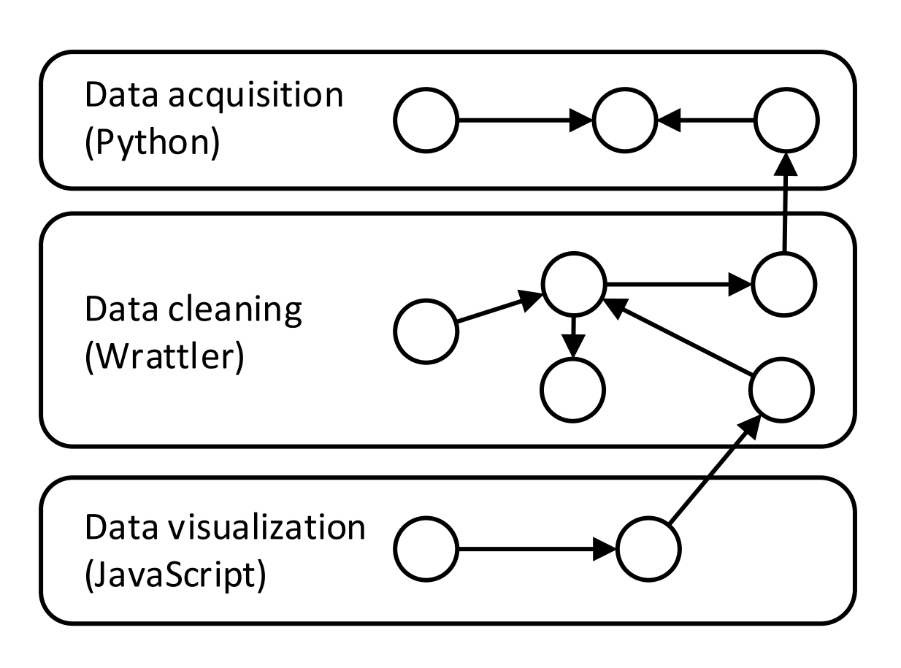

- title : Data exploration through dot-driven development 
- description : 
- author : Tomas Petricek
- theme : white
- transition : none

****************************************************************************************************

# Wrattler: _Interactive, smart  and polyglot notebooks_

<h4 style="margin-bottom:0px;margin-top:300px">James Geddes<em>, Tomas Petricek, Charles Sutton</em></h4>

_[https://github.com/wrattler](https://github.com/wrattler)_

----------------------------------------------------------------------------------------------------

**W**  
**R**  
**A**  
**T**  
**T**  
**L**  
**E**  
**R**  

----------------------------------------------------------------------------------------------------

**W** _Wrangle_  
**R** _Reproduce_  
**A** _Analyse_  
**T** _Transform_  
**T** _Troubleshoot_  
**L** _Learn_  
**E** _Explore_  
**R** _Revise_  

****************************************************************************************************

### What makes data science hard?

 

_<i class="fa fa-hand-spock"></i>_ Big data is big  
 _Hard-to-find special cases_

_<i class="fa fa-calendar-alt"></i>_ The Double Anna Karenina principle  
 _Every data set is different_

_<i class="fa fa-sync-alt"></i>_ Feedback loops everywhere  
 _Can't say what works until we've done it_

_<i class="fa fa-align-justify"></i>_ Death by a thousand cuts  
 _Many tasks are repetitive_

----------------------------------------------------------------------------------------------------

### Data science 
_What tools do we need?_

 

_<i class="fa fa-comment"></i>_ Interactive – _give quick feedback_

_<i class="fa fa-retweet"></i>_ Reproducible – _be able to go back_

_<i class="fa fa-sign-language"></i>_ Polyglot – _mix tools that work_

_<i class="fa fa-flask"></i>_ Smart – _get help from the AI_

_<i class="fa fa-user"></i>_ Explainable – _no black boxes_

----------------------------------------------------------------------------------------------------

----------------------------------------------------------------------------------------------------

## Traditional notebook architecture

_1 Limited reproducibility_  
_2 No rollback of state_  
_3 Limited interaction model_  
_4 One language per kernel_  

----------------------------------------------------------------------------------------------------

## Wrattler system architecture

----------------------------------------------------------------------------------------------------

## Wrattler system architecture
 
_1 Versioning and provenance_  
_2 Interactive development_  
_3 Platform for AI assistants_  
_4 Polyglot programming_  

****************************************************************************************************

# Project plan
_From prototype to open-source project_

----------------------------------------------------------------------------------------------------

### Project status
_Wrattler prototype available at [github.com/wrattler](http://github.com/wrattler)_

 

_<i class="fa fa-check-square"></i>_ Done – _Prototype and architecture_ 
 _Dependency graph and datadiff assistant_

_<i class="fa fa-cog"></i>_ Current – _System development_ 
 _AIDA data analyses and JupyterLab integration_

_<i class="fa fa-eye"></i>_ Research – _Open questions_ 
 _Further AI assistants and semantic data store_

----------------------------------------------------------------------------------------------------

### Development milestones
_Detailed plan [available on GitHub](https://github.com/wrattler/wrattler/issues/9)_

 

_0_ Basic browser notebook  _(mid-August)_  
_1_ Internal alpha version _(mid-September)_  
_2_ Public with AIDA analyses _(end of November)_  
_3_ Adding more assistants _(end of February)_  

****************************************************************************************************

# Wrattler prototype 
_Noteboks that are_ 1 interactive 
2 smart _and_ 
3 polyglot

----------------------------------------------------------------------------------------------------

### 1 Interactive
_Tighter interaction feedback loop_

 

_<i class="fa fa-globe"></i> Browser-based language_

_<i class="fa fa-stopwatch"></i> Recalculated on-the-fly_

_<i class="fa fa-arrow-up"></i> Using dependency graph_

----------------------------------------------------------------------------------------------------

----------------------------------------------------------------------------------------------------

----------------------------------------------------------------------------------------------------

### 2 Smart
_Simplifying process with AI assistants_

 

_<i class="fa fa-database"></i> Full access to data store_

_<i class="fa fa-language"></i> Domain specific languages_

_<i class="fa fa-archive"></i> No black box magic_

----------------------------------------------------------------------------------------------------

----------------------------------------------------------------------------------------------------

### 3 Polyglot
_Enabling platform for data science_

 

_<i class="fa fa-table"></i> Share data via data frames_

_<i class="fa fa-archive"></i> Computation graph for provenance_

_<i class="fa fa-comment-alt"></i> Semantic annotations_

----------------------------------------------------------------------------------------------------

****************************************************************************************************

# Summary
_Interactive, smart and polyglot notebooks_

----------------------------------------------------------------------------------------------------

### Wrattler
_Three key ideas behind the system_

 

_<i class="fa fa-database"></i> Separate state and language runtimes_

_<i class="fa fa-globe"></i> Dependency graph in the browser_

_<i class="fa fa-magic"></i> Platform for AI assisted data science_

----------------------------------------------------------------------------------------------------

## Questions, answers & discussion

#### Data store – _Best data and annotation formats?_

#### Integration – _Languages? Jupyter integration?_

#### AI assistants – _What kinds of assistants?_

 
 

_[http://tomasp.net](http://tomasp.net/academic) |
[tomas@tomasp.net](mailto:tomas@tomasp.net) |
[@tomaspetricek](http://twitter.com/tomaspetricek)_

> To wrap up, I'll end with a slide that lists the three next papers that I plan to write.
> The first one is about implementing live programming environments, which is surprisingly
> tricky and the second one is extending the data aggregation work to cover data cleaning with
> AI assistants. Finally, I talked about one of the things that I'm interested in, but I also
> work on philosophy and history of programming and I got invited to submit a paper to an
> ACM HOPL conference, so that's my third. I have ideas about coeffects too, but I only wanted
> to list three.
