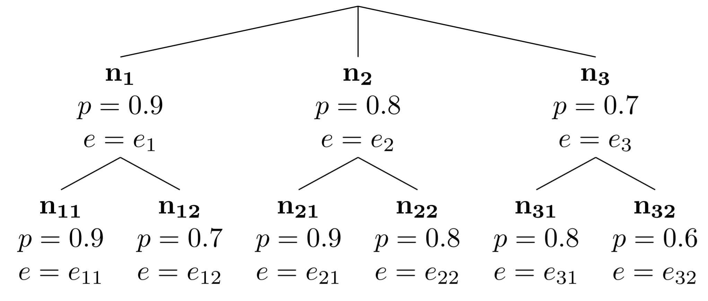
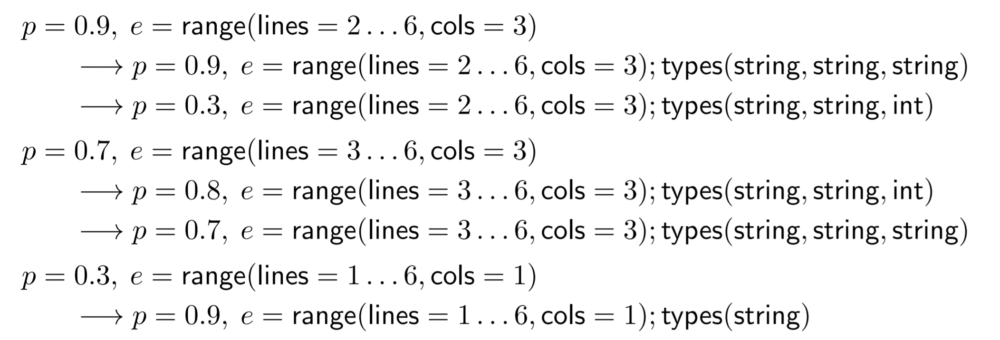

- title : Data exploration through dot-driven development 
- description : 
- author : Tomas Petricek
- theme : white
- transition : none

****************************************************************************************************

# _AIDA Team Meeting_ What is an AI assistant?

<h4 style="margin-bottom:0px;margin-top:250px">Tomas Petricek<em> with Alfredo Nazabal and Gerrit van den Burg</em></h4>

_[https://github.com/wrattler/wrattler-publications](https://github.com/wrattler/wrattler-publications)_

****************************************************************************************************

### What makes data science hard?

 

_<i class="fa fa-hand-spock"></i>_ Big data is big  
 _Hard-to-find special cases_

_<i class="fa fa-calendar-alt"></i>_ The Double Anna Karenina principle  
 _Every data set is different_

_<i class="fa fa-sync-alt"></i>_ Feedback loops everywhere  
 _Can't say what works until we've done it_

_<i class="fa fa-align-justify"></i>_ Death by a thousand cuts  
 _Many tasks are repetitive_

****************************************************************************************************

### AI assistants 
_Keeping human in the loop_

 

_<i class="fa fa-flask"></i>_ Smart – _get help from the AI_

_<i class="fa fa-comment"></i>_ Interactive – _allow user intervention_

_<i class="fa fa-hand-point-right"></i>_ Exploratory – _provide explanation and feedback_

_<i class="fa fa-retweet"></i>_ Reproducible – _produce transparent scripts_

_<i class="fa fa-sign-language"></i>_ Polyglot – _mix tools that work_

****************************************************************************************************

# What is an AI assistant?
_Modelling AI assistants as trees_

****************************************************************************************************

## AI assistants as trees

 - _Given data, AI assistant builds a tree_
 - _Each node represent a user choice_
 - _Each node returns a cleaning script_
 
****************************************************************************************************

****************************************************************************************************

$$$
\begin{equation*}
\begin{array}{rcll}
a &=& {Data} \rightarrow t &\text{(AI assistant)}\\
t &=& (n_1, p_1, e_k, t_1), \ldots (n_k, p_k, e_k, t_k) &\text{(Option nodes)}\\
\mathit{eval} &=& {Data}\times e \rightarrow {Data}&\text{(Evaluator for the DSL)}
\end{array}
\end{equation*}

****************************************************************************************************

# Cleaning CSV files
_Example of a simple AI assistant_

****************************************************************************************************

    [lang=text]
    Counts of things
    Copyright (c) Poor data export company, London, UK
    Name, City, Count
    Joe, London, 3
    Jane, Edinburgh, 16
    Jim, Cardiff, na

****************************************************************************************************

### Cleaning CSV files
_Domain specific language for CSV cleaning_

 

 - _Specify area with data_  
   ${range}({lines}=l_n\ldots l_m, {cols}=k)$

 - _Specify types of columns_  
   ${types}(t_1,\ldots, t_k)$

****************************************************************************************************

### AI assistant for CSVs
_A sample tree allowing interactive cleaning_

****************************************************************************************************

# Datadiff AI assistant
_Example of a simple AI assistant_

****************************************************************************************************

    [lang=text]
    Name, City             City, Name, Count   
    Joe, London            Cardiff, Alice, 1    
    Jane, Edinburgh        Cardiff, Bob, na        
    Jim, London            Edinburgh, Bill, 2    

****************************************************************************************************

### Matching CSV files
_Domain specific language for datadiff_

$$$
\begin{equation*}
\begin{array}{lcll}
p &=& {permute}(\pi) &\text{(Reorder columns)}\\
  &|& {recode}(i, [s_1\mapsto s_2, \ldots]) &\text{(Recode categorical column $i$)}\\
  &|& {linear}(i, a, b)&\text{(Linear transform column $i$)}\\
  &|& {delete}(i)&\text{(Drop column $i$)}\\
  &|& {insert}(i, d)&\text{(Insert a column at $i$)}
\end{array}
\end{equation*}

****************************************************************************************************

### AI assistant for datadiff
_A sample tree allowing interactive patch application_

****************************************************************************************************

### A better datadiff
_Improving interactivity of datadiff_

 - _Collect a set of user_ constraints 
 - _Run optimization_ under constraints
 - _At each node offer_ best patchset 
 - _offer most likely_ constraints to add
 
 
****************************************************************************************************

# Evaluating AI assistants
_How do we know our assistants are good?_

****************************************************************************************************

### Evaluating AI assistants

 

 - Using assistant in automatic mode 
   _Follow the best path through the tree_
   
 - Depth of the best solution 
   _How many interactions are needed to get it_   

****************************************************************************************************

### Evaluating AI assistants
_Interactivity for annomaly handling_

    [lang=text]
    Name, Count, ID      Name, Code, Value
    Jim, 45, 1           Alice, 35, 4 
    Jane, 52, 2          Bill, 38, 5  
    Joe, 67, 3           Bob, 42, 6 

****************************************************************************************************

### Adversary annomalies
_Inputs that an automatic tool cannot recognize as outliers_
 
 - _United States, Refugee Olympic Athletes, China_
 - _190.52, 58.68, 123.45, 67.47, 47.69_

How good is my AI assistant?  
_Given an input data with adversary annomalies, how many interactions do we need to eliminate them?_

****************************************************************************************************

### What is an AI assistant?
_AI assistants as "decision trees"_

 

 - Interactivity - _how to keep human in the loop_
 - Transparency - _producing DSL expressions_
 - Quality - _how do we evaluate AI assistant_
 
****************************************************************************************************

### What is an AI assistant?
_Open questions about AI assistants_

 

 - _What are adversary annomalies?_
 - _Constraint-based AI assistants_
 - _How to combine AI assistants (automatically)?_
 
Draft: _[https://github.com/wrattler/wrattler-publications](https://github.com/wrattler/wrattler-publications)_

