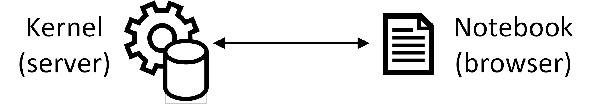
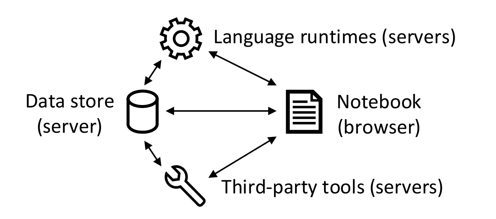
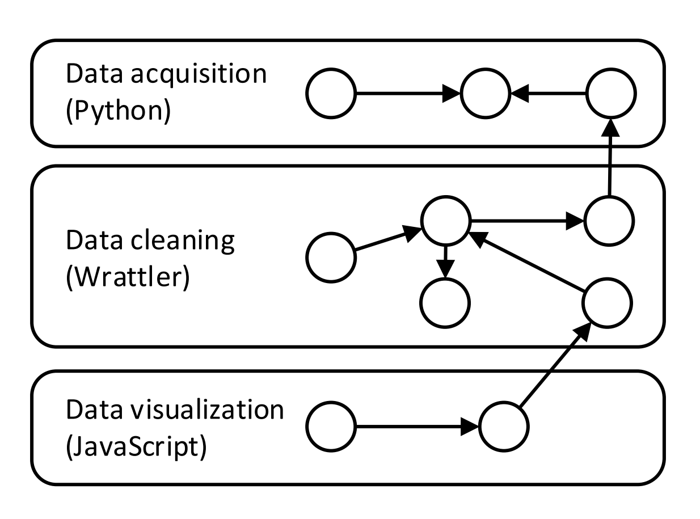

- title : Data exploration through dot-driven development 
- description : 
- author : Tomas Petricek
- theme : white
- transition : none

****************************************************************************************************

# Wrattler: _Interactive, smart  and polyglot notebooks_

<h4 style="margin:300px 0px 0px 0px">Tomas Petricek <em>for the AIDA team</em></h4>

_[http://tomasp.net](http://tomasp.net/academic) |
[tomas@tomasp.net](mailto:tomas@tomasp.net) |
[@tomaspetricek](http://twitter.com/tomaspetricek)_

****************************************************************************************************

### What makes data science hard?

 

_<i class="fa fa-hand-spock"></i> Hard-to-find special cases_

_<i class="fa fa-calendar-alt"></i> Every data set is correct in its own way_

_<i class="fa fa-sync-alt"></i> Can't say what works until we've done it_

_<i class="fa fa-align-justify"></i> Many tasks are repetitive by nature_

----------------------------------------------------------------------------------------------------

### What do we want?

 

_<i class="fa fa-comment"></i>_ Interactive tools _to give quick feedback_

_<i class="fa fa-retweet"></i>_ Reproducible _for being able to go back_

_<i class="fa fa-sign-language"></i>_ Polyglot _to mix tools that work_

_<i class="fa fa-flask"></i>_ Smart _to get help from AI assistants_

_<i class="fa fa-user"></i>_ Explainable _without magical black boxes_

----------------------------------------------------------------------------------------------------

### AI for Data Analytics 

 

_<i class="fa fa-eye"></i>_ Understanding data 
 _What type does it have?_

_<i class="fa fa-filter"></i>_ Merging data sources 
 _Tabular data across files (datadiff)_

_<i class="fa fa-database"></i>_ Reading data from external sources 
 _Making sense of real-world CSV files_

_<i class="fa fa-magic"></i>_ Putting it all together 
 _Interactive, smart and polyglot notebooks_

****************************************************************************************************

# Wrattler vision
_Making notebooks interactive, smart and polyglot_

----------------------------------------------------------------------------------------------------

# DEMO
_Analysing broadband speed in Wrattler_  

----------------------------------------------------------------------------------------------------

## Traditional notebook architecture

_1 Limited reproducibility_  
_2 No rollback of state_  
_3 Limited interaction model_  
_4 One language per kernel_  

----------------------------------------------------------------------------------------------------

## Wrattler system architecture

----------------------------------------------------------------------------------------------------

## Wrattler system architecture
 
_1 Versioning and provenance_  
_2 Interactive development_  
_3 Platform for AI assistants_  
_4 Polyglot programming_  

****************************************************************************************************

# Wrattler prototype 
_Making notebooks_ 1 interactive 
2 smart _and_ 
3 polyglot

----------------------------------------------------------------------------------------------------

### 1 Interactive
_Giving feedback as soon as possible_

 

_<i class="fa fa-globe"></i> Browser-based language_

_<i class="fa fa-stopwatch"></i> Recalculated on-the-fly_

_<i class="fa fa-arrow-up"></i> Using dependency graph_

----------------------------------------------------------------------------------------------------

----------------------------------------------------------------------------------------------------

# 1 DEMO
Interactive – _Exploring data in the browser_

----------------------------------------------------------------------------------------------------

### 2 Smart
_Simplifying process with AI assistants_

 

_<i class="fa fa-database"></i> Data access via the data store_

_<i class="fa fa-edit"></i> Domain specific languages_

_<i class="fa fa-eye"></i> Generate cleaning script, not clean data_

----------------------------------------------------------------------------------------------------

# 2 DEMO
Smart – _Cleaning data with the datadiff assistant_

----------------------------------------------------------------------------------------------------

### What is an AI assistant?

_1 Run some AI 
2 Ask the user 
3 Repeat_

 

_AI assistants as interaction trees_

 - _Each node represents a user choice_
 - _Each node provides a cleaning script_
 
----------------------------------------------------------------------------------------------------

### 3 Polyglot
_Enabling platform for data science_

 

_<i class="fa fa-table"></i> Share data via data frames_

_<i class="fa fa-archive"></i> Computation graph for provenance tracking_

_<i class="fa fa-comment-alt"></i> Semantics for information exchange_

----------------------------------------------------------------------------------------------------

# 3 DEMO
Polyglot – _Sharing data between R and JavaScript_

****************************************************************************************************

# Status update
_From prototype to open-source project_

----------------------------------------------------------------------------------------------------

### Project status

 

_<i class="fa fa-check-square"></i>_ Done – _Prototype and architecture_ 
 _Dependency graph and datadiff assistant_

_<i class="fa fa-cog"></i>_ Current – _System development_ 
 _Production version with AIDA data analyses_

_<i class="fa fa-eye"></i>_ Research – _Open questions_ 
 _Further AI assistants and semantic data store_

----------------------------------------------------------------------------------------------------

### Development milestones
_Working in the open to engage with community 
Follow the progress at: [github.com/wrattler](https://github.com/wrattler)_

 

_0_ Basic browser notebook  _(mid-August)_  
_1_ Internal alpha version _(mid-September)_  
_2_ Public with AIDA analyses _(end of November)_  
_3_ Adding more assistants _(end of February)_  

****************************************************************************************************

# Summary
_Making the hard part of data science easier_

----------------------------------------------------------------------------------------------------

### Wrattler
_Putting it all together_

 

_<i class="fa fa-magic"></i> Platform for AI assisted data science_

_<i class="fa fa-database"></i> Data store with semantic annotations_

_<i class="fa fa-globe"></i> Interactive with provenance in the browser_

----------------------------------------------------------------------------------------------------

### Questions, answers & discussion
_To be continued in a room next door!_

 

_1_ Interactivity – _How to advise the AI in datadiff?_ 
_2_ Problems – _Where can AI assistants help?_ 
_3_ Integration – _How to make it easy to use?_

 
 

Tomas Petricek _for the AIDA team_ 
_[http://tomasp.net](http://tomasp.net/academic) |
[tomas@tomasp.net](mailto:tomas@tomasp.net) |
[@tomaspetricek](http://twitter.com/tomaspetricek)_
