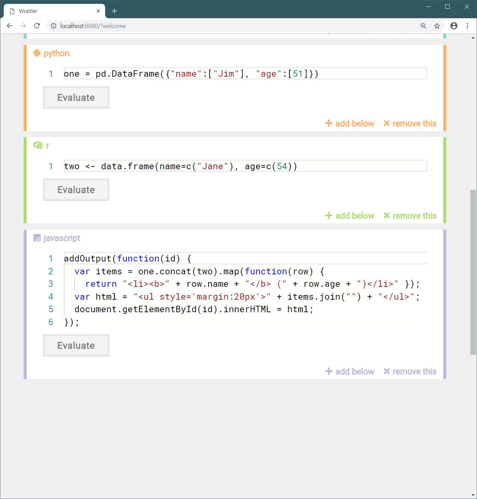

- title : Wrattler
- description :
- author : Tomas Petricek
- theme : white
- transition : none

****************************************************************************************************

# Wrattler: _Polyglot, reproducible  and smart notebooks_

    

#### _Demonstration of the developed  prototype system (GDI 1.6b)_

----------------------------------------------------------------------------------------------------

### Polyglot _Passing data from Python to JavaScript_

----------------------------------------------------------------------------------------------------

_We start with an empty notebook. Wrattler allows us
to add with_ Markdown _comments and cells with_ JavaScript, R  
_and_ Python _code._

----------------------------------------------------------------------------------------------------

_We use the Python_ pandas _library to easily load CSV file from an online source._

----------------------------------------------------------------------------------------------------

_After updating the cell and clicking the_ Evaluate _button, we see a preview of the downloaded data._

----------------------------------------------------------------------------------------------------

_Next, we add a_ JavaScript _cell with source code that uses the_ Plotly _library to build a visualization._

----------------------------------------------------------------------------------------------------

_When we evaluate the added code, Wrattler runs our_ JavaScript _directly_ in the web browser _and shows the visualization._

----------------------------------------------------------------------------------------------------

### Reproducible _Recomputation using provenance_

----------------------------------------------------------------------------------------------------

_Consider a sample notebook with two cells that define data frames `one` and `two`
and a third cell that concatenates the two and prints the result._

----------------------------------------------------------------------------------------------------

_We can evaluate cells one-by-one by clicking on_ Evaluate. _Here, we evaluated just the first (Python) cell._

----------------------------------------------------------------------------------------------------

_But you_ do not have to _run cells one-by-one. If we ask to evaluate the last cell, Wrattler
automatically_ runs  
all dependencies.

_Here, we evaluated  
the last cell and the second was evaluated automatically._

----------------------------------------------------------------------------------------------------

_If we modify a cell, Wrattler updates the_ dependency
graph _it maintains. Results of all cells that depend on a modified cell are removed and
need to be recomputed._

----------------------------------------------------------------------------------------------------

_Re-evaluating the last cell also evaluates all cells that it depends on, using the new_ dependency graph.

----------------------------------------------------------------------------------------------------

_If we revert a change back, we do not have to re-evaluate and we see_ earlier outputs immediately.

_Wrattler caches past dependency graph nodes and reuses a past node that has already been evaluated._

----------------------------------------------------------------------------------------------------

### Smart _Support for data cleaning tools_

----------------------------------------------------------------------------------------------------

_Wrattler supports other data wrangling and cleaning tools built as part of the_ AI for Data Analytics
_project such as_ datadiff. _As an example, we look at the UK broadband quality data set._

----------------------------------------------------------------------------------------------------

_We load two data sets,_ bb2013 _and_ bb2014 _which represent same data for two years, but
with some differences in the file structure._

----------------------------------------------------------------------------------------------------

_To do any data analysis, we need to reconcile the file structure. For this, we can run_ datadiff.
_by adding an R cell to our notebook._

----------------------------------------------------------------------------------------------------

_Datadiff takes two datasets and generates_ a list of patches _that can be applied to transform
the structure of the first dataset into the structure of the second dataset._

_We first print the inferred patches._

----------------------------------------------------------------------------------------------------

_We can switch the tab to_ bb2014nice _to see the new transformed dataset, which is now
compatible with the_ bb2013 _dataset._

----------------------------------------------------------------------------------------------------

_In addition to_ datadiff, _Wrattler also comes with examples showing_ ptype _for inferring types
of columns and_ CleverCSV _for  
smart CSV parsing._

----------------------------------------------------------------------------------------------------

### Comprehensive _Simplifying the data analytics process_

----------------------------------------------------------------------------------------------------

_Wrattler helps with_  
all stages _of the data analytics process._

_We look at a larger notebook, analysing the UK broadband quality data._

----------------------------------------------------------------------------------------------------

_We can mix_ R and Python _for loading data with_ JavaScript _for quickly visualizing and exploring data._

----------------------------------------------------------------------------------------------------

_We have access to_ datadiff _and other data wrangling tools, which help us make our data ready for interesting analytical tasks._

----------------------------------------------------------------------------------------------------

_Wrattler makes it easy to analyse data using the_ wide range of libraries _available for R and Python._
